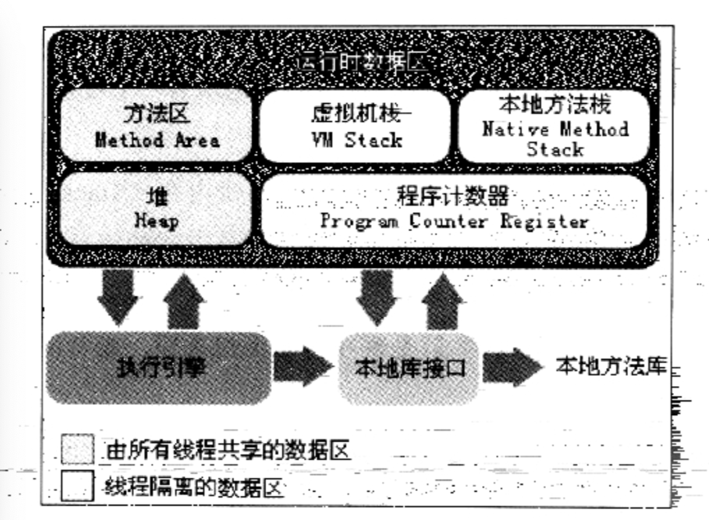
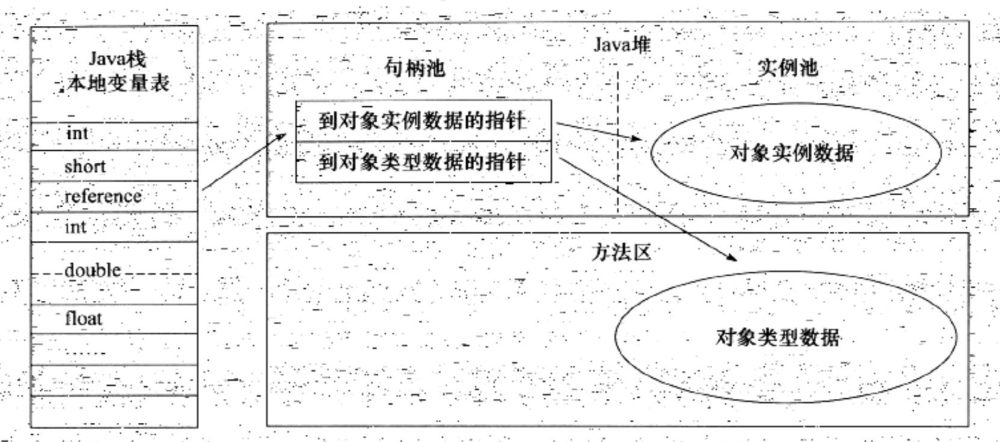
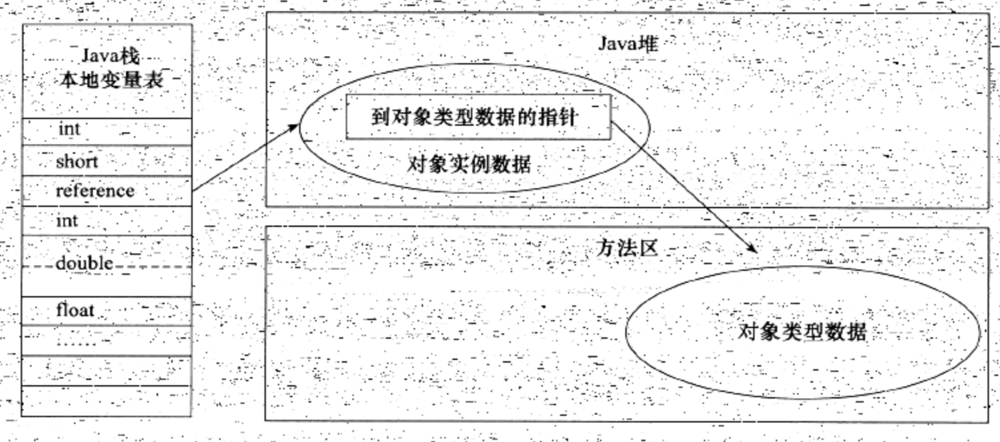

# Java内存模型

## 线程私有部分

### 程序计数器

- 当前线程所执行字节码的行号指示器，通过程序计数器来进行程序控制(循环、跳转、分支、异常处理)
- 任何一个时刻一个内核都只会执行一条线程中的指令，因此每条线程都只需要一个独立的程序计数器
- 如果线程正在执行一个Java方法，那么计数器记录当前字节码指令的地址。如果线程正在执行Native方法，那么计数器为空。

### Java虚拟机栈

  - 线程私有，与线程的生命周期相同
  - 每个方法被调用时，都会产生一个栈帧
  - 栈帧存储局部变量表、操作数栈、动态连接、方法出口
  - 方法调用完毕时栈帧会出栈
  - 线程请求的栈深度大于虚拟机所允许的深度：StackOverflowError,虚拟机栈扩展无法申请到足够的内存时:OutOfMemoryError

### 本地方法栈

- 作用和Java虚拟机栈相同，只不过它是为虚拟机调用Native本地方法使用的

## 线程共享部分

### Java堆

- 虚拟机中管理的内存最大的一块，同时也是垃圾收集器管理的内存区域
- 几乎所有的对象都在这里建立并分配内存
  
### 方法区

- 用于存储已经被虚拟机加载的类型信息、常量、静态变量、即使编译器编译后的代码缓存
- 运行时常量池：用于存放编译期生成的各种字面量和符号引用，属于方法区
  
## 对象的创建
1.  首先进行类加载检查，确定对象所需内存
2.  把一块确定大小的内存从Java堆中划分出来

### 内存划分
划分方法：
 - 指针碰撞，所有使用过的内存放在一边，所有没使用过的内存放在另外一边，通过修改指针来改变内存的使用情况
 - 空闲列表，用一个列表记录可用的内存块，在分配时从列表上找到一块足够大的空间然后再更新空闲列表

线程不安全：
- 使用CAS+失败重试保证更新操作的原子性
- 本地线程分配缓存（TLAB）：每个线程在Java堆中预先分配一小块内存
  
3. 将分配到的内存初始化为0（TLAB则在分配之前已经初始化）
4. 对对象进行必要设置，存放在对象头中
5. 执行构造函数

## 对象的内存布局

对象在堆内存中的存储布局可以划为三个部分：
- 对象头
- 实例数据
- 对齐填充

### 对象头
1. 用于存储对象自身运行时的数据，比如哈希码、GC分代年龄、锁状态标志等
2. 类型指针：指向类型元数据的指针
3. 如果对象是Java数组，则对象头必须还有一块用于记录数组长度的数据

## 对象的访问定位

访问方式：
- 句柄： 从Java堆中划分出一块内存作为句柄池，reference指向句柄池地址

- 直接指针访问：referred直接指向对象地址
