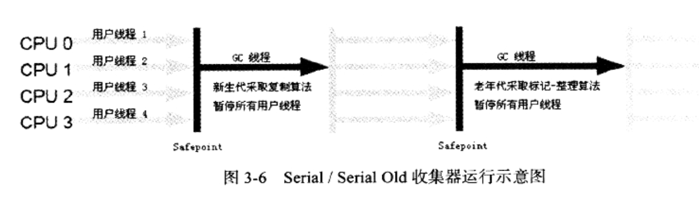

# 垃圾收集器

## 垃圾收集器处理的对象

不需要处理的对象：
1. 程序计数器
2. 虚拟机栈
3. 本地方法栈

以上对象随线程而生随线程而灭，当线程或者方法结束时，内存也就跟着回收了。每一个栈帧分配多少内存基本类结构确定下来就可以确定（运行时会少许优化）

**需要处理的对象：**

1. Java堆
2. 方法区

## 判断对象是否存活的方法：

### 引用计数方法

原理：被引用+1，引用失效时-1，垃圾收集器对数值为0的对象进行清除

评价：原理简单、效率高、但是要耗费额外的内存和计算

缺点：互相引用的情况下对象不能被回收，比如objA.object = objB objB.object = objA

### 可达性分析算法

原理：从GC Roots出发，根据引用关系向下搜索，清除掉该过程不可达的对象


#### GC Roots对象
GC Roots对象包括以下几种：
1. 在虚拟机栈（栈帧中的本地变量表）中被引用的对象。就是那些被各个线程调用的方法堆栈中的参数、局部变量、临时变量
2. 在方法区中类静态属性引用的对象（Java类的引用类型静态变量）
3. 方法区中常量引用的对象（比如字符串常量池里的引用）
4. 本地方法栈中JIN（Native方法）引用的对象
5. 虚拟机内部的引用（基本数据类型对应的Class对象、常驻异常对象、系统类加载器）
6. 所有被同步锁（synchronized)持有的对象
7. JMXBean、JVMTI、本地代码缓存


### Java中的各种引用
- 强引用：
最传统、最普遍的引用类型,例子 Object obj = new Object(),只要强引用存在，垃圾收集器就永远不会回收被引用的对象

- 软引用 SoftReference：软引用对象一般不会被GC清除，第二次GC才会被消除，比如在分配内存时内存不会就会触发第一次GC，第一次GC不会清除软引用对象，如果第一次GC结束内存还是不够就会触发第二次GC，此时才会清除弱引用对象

``` java
/**
 * 软引用何时被收集
 * 运行参数 -Xmx200m -XX:+PrintGC
 * Created by ccr at 2018/7/14.
 */
public class SoftReferenceDemo {

    public static void main(String[] args) throws InterruptedException {
        //100M的缓存数据
        byte[] cacheData = new byte[100 * 1024 * 1024];
        //将缓存数据用软引用持有
        SoftReference<byte[]> cacheRef = new SoftReference<>(cacheData);
        //将缓存数据的强引用去除
        cacheData = null;
        System.out.println("第一次GC前" + cacheData);
        System.out.println("第一次GC前" + cacheRef.get());
        //进行一次GC后查看对象的回收情况
        System.gc();
        //等待GC
        Thread.sleep(500);
        System.out.println("第一次GC后" + cacheData);
        System.out.println("第一次GC后" + cacheRef.get());

        //在分配一个120M的对象，看看缓存对象的回收情况
        byte[] newData = new byte[120 * 1024 * 1024];
        System.out.println("分配后" + cacheData);
        System.out.println("分配后" + cacheRef.get());
    }

}

第一次GC前null
第一次GC前[B@7d4991ad
[GC (System.gc())  105728K->103248K(175104K), 0.0009623 secs]
[Full GC (System.gc())  103248K->103139K(175104K), 0.0049909 secs]
第一次GC后null
第一次GC后[B@7d4991ad
[GC (Allocation Failure)  103805K->103171K(175104K), 0.0027889 secs]
[GC (Allocation Failure)  103171K->103171K(175104K), 0.0016018 secs]
[Full GC (Allocation Failure)  103171K->103136K(175104K), 0.0089988 secs]
[GC (Allocation Failure)  103136K->103136K(199680K), 0.0009408 secs]
[Full GC (Allocation Failure)  103136K->719K(128512K), 0.0082685 secs]
分配后null
分配后null
```

- 弱引用WeakReferenec：
强度比软引用更加弱，被弱引用引用的对象无论内存是否足够在GC时都会回收

- 虚引用：
最弱的引用关系，一个对象是否有虚引用完全不会对生存构成影响。为一个对象设置虚引用关联的唯一目的就是能在这个对象被收集器回收时收到一个**系统通知**。所以虚引用必须配合ReferenceQueue使用。


### finalize方法
什么时候触发finalize方法？

首先用GC Roots进行标记，然后进行一次筛选，如果对象没有finalize（）方法或者finalize（）已经被虚拟机调用过，就不会触发finalize（）

如果对象有必要执行finalize方法就会把这个对象放在F-Queue队列中，由一个线程去执行这些对象的finalize方法

#### finalize是对象最后一次自救的机会

如何自救？

重新与引用链上的任何一个对象建立关联即可

``` java
class User{
	
	public static User user = null;

	@Override
	protected void finalize() throws Throwable {
		System.out.println("User-->finalize()");
		user = this;
	}
	
}
```

只能自救一次：第一次触发finalize方法进行了自救，第二次就不能触发finalize方法了，这个对象就会被回收。


# 垃圾收集算法

## 标记清除算法

原理：首先对所有需要进行清除的对象进行标记，在清除的时候再统一对所有对象进行清除

缺点：内存碎片化问题、效率不高


## 标记整理算法

原理：首先对所有需要清除的对象进行标记，如果在要清除的时候把所有标记的对象移到一端，然后对清除边界外的所有对象。

解决了内存碎片化的问题还使年轻代的可用率达到100%，但是效率比较低

##  复制算法

原理： 将内存分为两块，每次只用其中一块，当一块内存用完之后，就把还存活的对象复制到另外一块内存上，并且清除所有这块内存的对象


### Eden和Survivor

在真实的Java虚拟机中，并不是把内存分成两块，而是分成8:1:1的一个Eden和两个Survivor区。每次使用Eden和一个Survivor，回收时将Eden和Survivor中存活的对象复制到另外一个Survivor区中。

- Eden和两个Survivor都被称为年轻代
- 所以每次可用的内存都只是年轻代的90%
- 我们不能保证每次10%的Survivor都可以存放所有存活都对象，所以有部分对象会被升级到**老年代**中

#### 什么情况下对象会被升级到老年代？
1. Survivor区放不下的对象
2. 计数器达到Max值（存活的对象每次进行一次复制计数器就+1）
3. 新生成的大对象


## 分代收集算法

把对象的存活周期分为年轻代和老年代，针对不同的年代使用不同的算法

在年轻代中，因为对象存活率低，所以可以使用复制算法

在老年代中，因为对象存活率高，必须使用标记-清除或标记-整理算法


# Minor GC和Full GC
Minor GC是新生代GC

Full GC是老年代GC


# 垃圾收集器


有连线说明可以配合使用

年轻代收集器：
- Serial
- ParNew
- Parallel Scavenge

老年代收集器：
- CMS
- Serial Old
- Parallel Old

介于两者之间：
- G1

## 年轻代收集器：

### Serial收集器

单线程收集器，在进行垃圾收集的时候必须Stop the world，停止其他的线程


Client模式下的默认收集器



### ParNew收集器

- Serial收集器的多线程版本，除了使用多线程来进行垃圾收集外，其他行为跟Serial收集器一样
- Server模式下的新生代收集器
- 单核CPU下ParNew不一定效率比Serial高
- 
为什么要用ParNew收集器？

CMS作为老年代收集器，只有Serial和ParNew收集器能与CMS配合使用


### Parallel Scavenge收集器

 - 年轻代、复制算法收集器、多线程收集器
 - 关注用户的吞吐量
吞吐量= 用户运行代码的时间 /（用户运行代码的时间+垃圾收集时间）
 - 两个重要参数：控制垃圾收集最高时间、设置吞吐量大小
垃圾收集最高时间不是越少越好，时间越少，新生代的容量就越少
-  可以进行自适应模式，不需要用户自己调节Eden区和Survivor区的比例、升级到老年代年龄，收集器会收集日志进行自动调节
  
## 老年代收集器

### Serial Old收集器

- Serial收集器的老年代版本
- 单线程收集器、标记整理算法
- CLient模式下使用

### Parallel Old收集器
- Parallel Scaveng收集器的老年代版本
- 多线程收集器、标记整理算法
- 与Parallel Scaveng配合使用
在Parallel Old未出现之前，Parallel Scavenge只能和Serial Old配合使用，Serial Old的单线程严重拖累年轻代的清除速度

### CMS收集器

以最短停顿时间为目标的收集器，适合用于服务器，给用户带来良好的体验

CMS是基于标记清除算法实现的，有以下四个步骤：
1. 初始标记
2. 并发标记
3. 重新标记
4. 并发清除
   
#### 初始标记
标记从GC Roots直接可达的老年代对象和新生代直接引用的老年代对象（JDK7之前单线程，JDK8之后并行） 


#### 并发标记

- 上一阶段被标记的对象开始tracing，标记所有可达对象
- 垃圾回收线程和应用线程会同时进行


### 重新标记

应该重新标记哪些对象？

1. 并发标记过程会使部分对象从新生代升级到老年代
2. 老年代的对象引用会发生改变
3. 有些对象会直接分配给老年代
4. 新生代对象
5. GC Roots

如果预清理没有做好，扫描新生代会花费很多时间

### 并发清除

清除所有标记的对象


## CMS评价：
整个过程最耗时的并发标记和并发清除都可以与用户进程一起执行，使停顿很低

3个明显的缺点：
1. 标记清除算法会导致内存碎片化
2. 对CPU资源敏感，CMS会占用线程导致程序变慢，CPU低时对用户程序的影响很大
3. 无法处理浮动垃圾：CMS并发清理时产生新垃圾并且没有被标记的垃圾

## G1收集器

特点：
1. 并行和并发，使用多个CPU来缩短Stop the World时间
2. 分代收集，不需要其他收集器配合就可完成
3. 标记整理算法，不会产生空间碎片
4. 可预测的停顿时间
5. 收集的范围为整个新生代和老年代，但是不再物理隔离，而是都是Region集合

运作步骤：
1. 初始标记
2. 并发标记
3. 最终标记
4. 筛选回收

# 内存分配和回收策略

对象大方向来讲都在堆中分配，小方向来将主要分配在新生区Eden区上，如果启动来本地线程分配缓存，将按线程优先在TLAB上分配。少数在老年代中分配

## 对象优先在Eden区分配

当Eden区的内存不足时，会发起一次Minor GC

## 大对象直接进入老年代

大对象是需要大量连续内存空间的Java对象，比如很长的字符串和数组


### 长期存活的对象进入老年代

虚拟给每个对象都初始化一个对象年龄为0，一开始对象在Eden区中，当Minor GC后仍然存活并且Survivor中仍然还有空间，就把这个对象复制到Survivor区中并且年龄+1，每次Minor GC后存活年龄都+1.直到年龄达到设定的值 -XX：MaxTenuringThreshold就会进入老年代

**动态年龄判定：**

虚拟机不是永远都要求对象年龄必须大于MaxTenuringThreshold才会进入老年代。
如果Survivor区中相同年龄的对象大小总和大于Survivor区空间的一半，年龄大于等于该年龄的对象直接进入老年代
