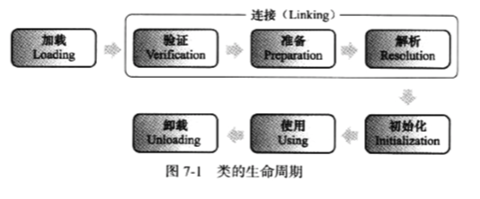

# 虚拟机类加载机制

类加载机制：虚拟机把描述类的数据从Class类文件加载到内存，并对数据进行校验、转换解析和初始化，最终形成可以被虚拟机直接使用对Java类型

特点：Java类型的加载、连接和初始化都是在程序运行期间完成的

## 类加载时机

一个类型从被加载到虚拟机内存中到卸载过程中会经历以下步骤：
1. 加载
2. 验证
3. 准备
4. 解析
5. 初始化
6. 使用
7. 卸载
   


验证、准备、解析称为连接

### 类初始化的时机（六种情况）

1. 遇到new、getstatic、putstatic或invokestatic这些字节码指令的时候
这些字节码的场景：
 - 使用new关键字实例化对象
 - 读取一个静态类型字段
 - 调用一个类型的静态方法
2. 使用反射调用时，如果类型没有初始化就要先触发初始化
3. 初始化一个类，如果发现父类还没有初始化就要先触发父类的初始化
4. 虚拟机启动先加载的主类（包括mian）
5. 动态语言支持的一些情况
   
## 类加载的过程

### 加载

类加载器完成以下内容：
1. 通过类的全限定名获取定义此类的二进制字节流
2. 将字节流的静态存储结构转化为方法区的运行时数据结构
3. 在内存中生成一个代表这个类的java.lang.Class对象，作为方法区类的数据的访问入口

这个过程是类加载中可控性最强的阶段，因为我们可以用系统提供的类加载器也可以用用户自定义的类加载器(重写 loadClass()方法)

### 验证

连接阶段的第一步，为了确保Class文件的字节流不会危害虚拟机自身安全

验证阶段会完成以四步验证动作：

#### 1. 文件格式验证

验证字节流是否符合Class文件的规范，保证输入的字节流能正确地解析并存储于方法区中

只有这一步是验证二进制字节流的后面的三个步骤都是验证方法区的存储结构，不会再操作字节流

#### 2.元数据验证

对字节码描述的信息进行语义分析，保证符合Java语言规范

#### 3.字节码验证

最复杂的验证过程，对类的方法体进行校验分析、保证校验类的方法在运行时不会作出危害虚拟机安全的事件

#### 4.符合引用验证

1. 符号引用中通过字符串描述的全限定名是否找到对应的类
2. 指定类中是否存在方法的字段描述符
3. 符号引用中的类、字段、方法是否可以被访问(private,protected,public,default)


### 准备

正式为类变量分配内存并设置类变量初始值的阶段，这些变量的内存都在方法区中匹配。

这里进行内存分配的仅是类变量，也就是被static修饰的变量，不包括实例变量.比如：public static int value = 123;

变量准备阶段过后初始值为0，赋值的操作在初始化阶段init才会执行

### 解析

虚拟机将常量池内的符号引用替换成直接引用的过程。

符号引用是什么？

比如
``` java

String s = "abc"
String c = s+ "2";

```
这里的s就是符号引用


直接引用是什么？

1. 直接指向目标的指针。

2. 相对偏移量。      （指向实例的变量，方法的指针）

3. 一个间接定位到对象的句柄。

解析分为以下几步：
1. 类或接口的解析
2. 字段解析
3. 类方法解析
4. 接口方法解析

### 初始化

类加载的最后一步，真正开始执行类中定义的Java程序代码

## 类与类加载器

类加载器除了实现类的加载动作，还有以下功能：

比较两个类是否相等，包括类Class对象的equals()方法、isAssignableForm()方法、isInstance()方法

## 三层类加载器

1. 启动类加载器
负责加载存放在<JAVA_HOME>/lib目录下或者指定路径的名字符合的类库，加载启动相关的基础模块

2. 扩展类加载器
加载平台相关的模块

3. 应用程序类加载器
加载应用级别的模块，还加载classpath路径中的所有类库

## 双亲委派模型

大致概念：除了启动类加载器之外，其他类加载器的加载都应该由它的父级类加载器来完成

流程如下：

1. 一个类加载器在接收到类加载请求后，首先不会自己加载这个类，而是把这个请求委派给父类加载器去完成
2. 每一层类加载器都是如此，因此所有类加载器的加载都会传送到最顶层的启动类加载器中加载
3. 如果启动类加载器无法完成加载，子加载器才会尝试自己去加载


优点：
1. 能够保证每个类只被加载一次
2. 能够某个类在各种类加载器环境中都能保证是同一个类。如果没有双亲委派模型让子加载器自己去加载，那么程序中会出现很多同名但不同的类


jdk1.8 Java.lang.ClassLoader中的loadClass()函数


```java

protected Class<?> loadClass(String name, boolean resolve)
        throws ClassNotFoundException
    {
        synchronized (getClassLoadingLock(name)) {
            // First, check if the class has already been loaded
            Class<?> c = findLoadedClass(name);
            if (c == null) {
                long t0 = System.nanoTime();
                try {
                    if (parent != null) {
                        c = parent.loadClass(name, false);
                    } else {
                        c = findBootstrapClassOrNull(name);
                    }
                } catch (ClassNotFoundException e) {
                    // ClassNotFoundException thrown if class not found
                    // from the non-null parent class loader
                }

                if (c == null) {
                    // If still not found, then invoke findClass in order
                    // to find the class.
                    long t1 = System.nanoTime();
                    c = findClass(name);

                    // this is the defining class loader; record the stats
                    sun.misc.PerfCounter.getParentDelegationTime().addTime(t1 - t0);
                    sun.misc.PerfCounter.getFindClassTime().addElapsedTimeFrom(t1);
                    sun.misc.PerfCounter.getFindClasses().increment();
                }
            }
            if (resolve) {
                resolveClass(c);
            }
            return c;
        }
    }


```

如果是要自己实现类加载器，应该覆盖finaclass方法