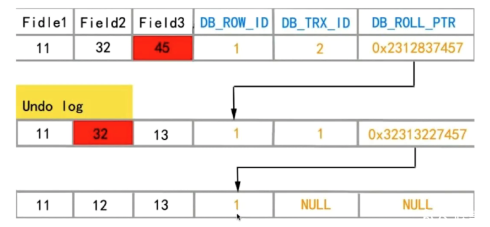

# 事务的四大特性
ACID就是事务的四大特性，它们分别是原子性(Atomic)、一致性(Consistency)、隔离性(Isolation)、持久性(Durability)

- 原子性：数据库中的每个事务都是不能再次分割的，要么一起操作成功，要么一起操作失败回滚，不能出现一个事务中一句执行成功了而另外一句没有执行成功的情况
- 一致性：一致性是指数据库中的事务从一种状态变到另外一种状态，而数据库的完整性没有被破坏。比如A和B的总金额是2000元，无论A和B之间发生怎么样的交易，它们的总金额仍然是2000元
- 隔离性：数据库中的一个事务的执行不能影响另外其他事务的执行
- 持久性：事务一旦提交，它的结果就是永久性的，如果发生宕机，数据库也能够恢复。


# 事务的并发的问题以及隔离级别

事务的并发问题和隔离级别如下：

|事务隔离级别	|脏读	|不可重复读	|幻读|
|  ----  | ----  | ----  | ----  |
|读未提交（read-uncommitted）	|是	|是	|是|
|不可重复读（read-committed）	|否	|是	|是
|可重复读（repeatable-read）	|否	|否	|是
|串行化（serializable）	|否	|否	|否


查询数据库隔离级别的语句：

```SQL
select @@tx_isolation;

```
设置数据库隔离级别的语句：
```SQL
set session transaction isolation level read committed;

```

## 更新丢失
例子：


|  事务1   | 事务2  |
|  ----  | ----  |
| begin  | begin |
| 查询金额 = 100 | 查询金额 = 100 |
| 设置金额 = 100+20失败 | 设置金额 = 100+30 |
|  回滚，设置金额=100 | 查询金额 = 100 |

以上是一个更新丢失的例子，它在所有的隔离级别下都可以避免


## 脏读

脏读在未提交读(read-uncommited)下会发生，指读取到其他事务未提交的数据，具体的例子如下:
|  事务1   | 事务2  |
|  ----  | ----  |
| start transaction  |  |
| select * from t where id = 1(查询到balacne为1000) |  |
| update t set balance = 1000 - 100 | start transaction |
|   | select * from t where id = 1(查询到balacne为900，此时为脏读) |
|  rollback | update t set balance = 900 - 100 |
|  select * from t where id = 1(查询到balacne为800) |  |

在以上的例子中事务1进行了回滚导致数据库id为1这一行的balance值莫名减少了100，而真正发生脏读的时候是在事务1回滚前事务2查询balance时

当我们把事务隔离级别设置为已提交读(read-commited)或者更高级之后就可以避免这一场景，那么会变成如下：

|  事务1   | 事务2  |
|  ----  | ----  |
| start transaction  |  |
| select * from t where id = 1(查询到balacne为1000) |  |
| update t set balance = 1000 - 100 | start transaction |
|   | select * from t where id = 1(查询到balacne为1000，此时就避免了脏读) |
|  rollback | update t set balance = 1000 - 100 |
|  select * from t where id = 1(查询到balacne为900) |  |


这样我们就避免了脏读，保持了数据的一致性

## 不可重复读

在同一个事务中没有变更的情况下前后两次读取到的结果不一样，在未提交读(read-uncommited)或者隔离级别更低的情况下会发生，例子如下：

|  事务1   | 事务2  |
|  ----  | ----  |
| start transaction  | start transaction |
| select * from t where id = 1(查询到balacne为1000) | update t set balance = 1000 - 100 |
| select * from t where id = 1(查询到balacne为1000)  |  |
|  | commit |
| select * from t where id = 1(查询到balacne为900，此时为幻读)  |  |

我们把事务级别设置为可重复读(repeatable-read)就可以避免

|  事务1   | 事务2  |
|  ----  | ----  |
| start transaction  | start transaction |
| select * from t where id = 1(查询到balacne为1000) | update t set balance = 1000 - 100 |
| select * from t where id = 1(查询到balacne为1000)  |  |
|  | commit |
| select * from t where id = 1(查询到balacne为1000)  |  |
| update t set balance = balance - 100 |  |
| commit |  |
| select * from t where id = 1(查询到balacne为800)  |  |
但是假如现在对事务1进行update操作，update的值也是最新的事务2commit后的值


## 幻读

在事务中无故出现一条新的数据的情况

以下例子可以体现：

|  事务1   | 事务2  |
|  ----  | ----  |
| start transaction  |  |
| select * from t (查询到4条记录) | start transaction |
|  | insert into t  VALUES(4,400) |
|  update t set balance = 100(此时显示更新了5条记录，出现了幻读) |  |

幻读我们可以设置事务的隔离级别为串行化serializable可以避免，在串行化事务隔离级别下，所以的事务都是串行执行的

其实在InnoDb中，事务隔离级别为可重复读都可以避免幻读，这是因为它的快照读机制

## 当前读和快照读

快照读读取到的是数据的可见版本，所以快照读读取到的可能是语句过期的数据

而当前读读取到的是数据的最新版本，并且当前读返回的记录都会加上锁，保证其他事务不会再并发的修改这条记录


**什么情况下会触发当前读和快照读？**

当前读会对记录进行上锁，所以需要上锁的读取都是当前读，比如select ..... lock in share mode、select ..... for update、update、delete、insert

普通的select和不加锁的非阻塞读会触发快照读

当前读和快照读的例子如下：

|  事务1   | 事务2  |
|  ----  | ----  |
| start transaction  | start transaction |
| select * from t where id = 1(快照读，读取到balance为100) | select * from t where id = 1(快照读，读取到balance为100) |
| update set balance = 200 where id = 1 |  |
| commit |  |
|  | select * from t where id = 1(快照读，读取到balance为100) |
|  | select * from t where id = 1 for update(当前读，读取到balance为200) |


事务首次调用快照读的地方很关键，决定了它往后的快照读都是同样的结果

## InnoDB快照读的实现方式

在数据列中除了真实的数据还有以下几列：

- DB_TRX_ID:最近修改这一行的事务ID
- DB_ROLL_PTR:回滚指针，只写入回滚段的undo 日志记录
  


- DB_ROW_ID:随着新行插入而单调递增的行ID.也是在InnoDB中没有主键情况下的默认隐藏建立的主键
  
Undo日志：
当我们对记录做了变更操作时，就会产生undo记录，undo记录中存储的是老版数据，当一个旧的事务需要读取数据时，为了能够读取到老版本的数据，需要顺着undo列找到满足其可见性的记录，这个找满足可见行的记录依赖 read view

read view
read view主要是用来做可见性判断的，即当我们去执行快照读 select 的时候，会针对我们查询的数据创建出一个 read view，来决定当前事务能看到的是哪个版本的数据，有可能是当前最新版本的数据，也可能是 undo log 中某个版本的数据，read view 遵循一个可见性算法。主要是将要修改的数据的 DB_TRX_ID 取出来，与系统其他活跃事务ID【DB_TRX_ID】做对比，如果大于或者等于这些 ID 的话，就通过 DB_ROW_PTR 指针去取出 un do log，上一层的 DB_TRX_ID 直到小于这些活跃事务 ID 为止，这样就保证了我们获取到的数据版本是当前可见的最稳定的版本


# MVCC

在数据库的并发场景有三种，分别为：
- 读-读：不存在任何问题，也不需要并发控制
- 读-写：有线程安全问题，可能会造成事务隔离性问题，可能遇到脏读，幻读，不可重复读
- 写-写：有线程安全问题，可能会存在更新丢失问题，比如第一类更新丢失，第二类更新丢失

MVCC实际上解决的是第二种场景，它的其中一个表现为快照读，它避免了加锁操作（当前读是悲观锁的体现），降低了开销，但是它当前读到的数据不一定是最新的数据，所以会发生更新丢失的问题。


关键文章：

https://cloud.tencent.com/developer/article/1431307