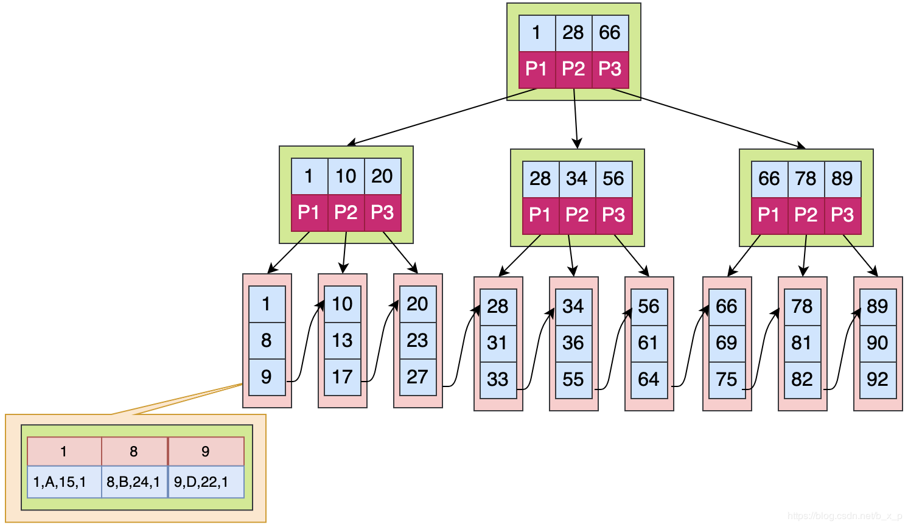

# 从二叉树到B+树分析为什么Mysql选择B+树作为索引

## 二叉树

二叉树是一种特殊的树状结果，它每个节点都只有左孩子和右孩子，每个节点的左孩子都比它的值要小，而每个节点的右孩子都比它的值要大。

所以当我们想要查找某个元素的时候，只需要按照它的左右孩子大小关系进行查找即可。

比如在以下树中搜索4的时候：
1. 首先访问根节点，根节点为5，5>4，所以访问5的左孩子。
2. 访问3，3<4,所以访问3的右孩子
3. 访问4，我们就找到了我们需要找的值

```bash
        5
       / \
      3   8
     / \   \
    1   4   10

```

但是在普通的二分搜索树中，没有对应的平衡控制，所以搜索的效率会退化成o(n),比如在以下的例子中，寻找10这个节点，需要遍历所有的节点

```bash
        5
         \
          7
           \
            9
             \
              10

```

为了解决平衡的问题，我们就引出了平衡二叉树

## 平衡二叉树

在平衡二叉树中，为了解决平衡的问题，它引入了左旋和右旋的方法，使得任何节点的两个子树的高度差不大于1，这就会使得查询的效率能够稳定在o(logn)。

但是为什么不选择平衡二叉树作为数据库的索引呢？主要原因如下：
1. 平衡二叉树每次访问一次节点就对应数据库的一次IO，因为操作系统和磁盘之间一次数据交换是以页为单位的，一页大小为 4K，即每次IO操作系统会将4K数据加载进内存。但是，在二叉树每个节点的结构只保存一个关键字，一个数据区，两个子节点的引用，并不能够填满4K的内容。第一，这会浪费4k的空间，第二，当平衡二叉树的节点达到百万级以上的时候，树的高度将会非常高，如果数据刚好在根节点，就会发送很多次的IO，使得大量时间花费在IO上
2. 平衡二叉树的查找效率不稳定，有时候只需要发生一次IO，有时要发生成千上万次的IO

为了解决这些问题就有了B树的概念

## B Tree

B Tree 是一个绝对平衡树，它的特点是所有的叶子节点都在同一高度

同时，为了解决平衡二叉树的高度问题，B Tree是一种n阶树，也就是它一个节点最多可以存放n个关键字和n+1个分支节点，这样就可以大大减少这颗树的高度，让一个节点的数据量尽量填满一页内存页。

以下是一个B Tree的例子,它是一个2阶树，它每个节点能够存放2个数据以及3个分支


缺点：在B Tree保证树的平衡的过程中，每次关键字的变化，都会导致结构发生很大的变化，这个过程是特别浪费时间的，所以创建索引一定要创建合适的索引，而不是把所有的字段都创建索引，创建冗余索引只会在对数据进行新增，删除，修改时增加性能消耗。

## B+ Tree

B+ Tree结构



B+ Tree是由B Tree演变而来的，它与B Tree的区别如下：
1. 它的数据只存放在叶子节点中，根节点以及非叶子节点的分支节点并不存放数据，这就会使得**非叶子节点能够存放的关键字更多**
2. B+ Tree的数据都在叶子节点中，每次查询都最终需要到叶子节点中去获取数据，所以每次**查询的效率是稳定**的
3. 叶子节点的数据是一条有序的链表结构，所以在作**范围查询**的时候，B+ Tree的效率会比B Tree高效很多
4. B+Tree扫库和扫表能力更强。如果我们要根据索引去进行数据表的扫描，对B TREE进行扫描，需要把整棵树遍历一遍，而B+TREE因为叶子节点数据是一条有序的链表，所以只需要遍历他的所有叶子节点即可。
