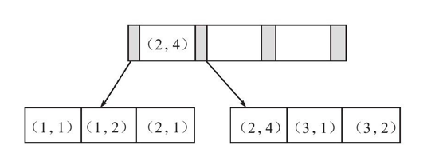

# 聚簇索引

聚簇索引就是按照每张表的主键创建一颗B+树，同时叶子节点中存放的是对应的主键的行数据，所以B+树中的数据也是聚簇索引的一部分，因为我们不能创建两个有相同数据的B+树（这样会很浪费硬盘空间）所以每张表只能拥有一个聚簇索引。

在大多数情况下，查询优化器都会偏向于使用聚簇索引，因为使用聚簇索引访问到的叶子节点直接是我们需要的数据。

# 非聚簇索引
非聚簇索引是在聚簇索引之外建立的索引，它的叶子节点不存储对应行的数据，而是存储对应的主键，所以在使用非聚簇索引获取到主键值之后还需要再走一次聚簇索引才能找到对应的数据。

因为非聚簇索引并不影响数据在聚簇索引上的组织，所以非聚簇索引可以建立很多个

# 覆盖索引

它的概念是，在非聚簇索引中可以直接得到的查询结果，就不需要再走一次聚簇索引了。
比如select id from table order by name，其中name是非聚簇索引，而id是主键，我们利用非聚簇索引name得出了id的值就不需要走主键索引了


# 联合索引

联合索引是对表上的多个列进行索引，如下图是建立的一个联合索引的例子



当我们对多个关键词进行组合查询的时候，联合索引就起作用了

比如我们建立的索引如下：

```SQL
alter table t add index c1_2(c1,c2);
```

然后我们使用以下语句，就会使用联合索引c1_2了


```SQL
select name from t where c1 = 2 and c2 = 3 ;
```
## 联合索引的最左匹配原则

最左优先，以最左边的为起点任何连续的索引都能匹配上。同时遇到范围查询(>、< between、like)就会停止匹配。

比如在以上的联合索引中，使用以下语句是可以使用索引c1_2(c1,c2)
```SQL
select name from t where c1 = xxx and c2 = xx ;
```
使用以下语句也是可以使用索引c1_2(c1,c2)的

```SQL
select name from t where c1 = xxx ;
```

这是因为我们之前建立的索引就是利用c1和c2建立的，但是如果是使用以下语句，就不会走索引c1_2(c1,c2)
```SQL
select name from t where c2 = xxx ;
```

我们可以查看之前的那颗B+树，可以发现叶子节点上的c2的值为1，2，1，4，1，2并不是有序的，所以使用联合索引并不能得出正确的结果。而使用c1或者c1联合c2得出的结果一定是有序的。


## 如何定位并查询优化慢查询sql

### 根据慢日志定位慢查询sql
  
1. 首先使用show variables like %quer%查询慢日志参数

执行以下语句后会获得两个变量
```SQL
show variables like %quer%
```

分别是long_query_time、slow_query_log和slow_query_log_file表示超过多少秒会把sql记录到日志中、慢查询日志是否开启和慢查询日志的地址

 2. 定位到慢查询日志后，找到对应的语句，使用explain+对应的sql语句查看关键字段
重要关键字段：

- type：对表访问方式，表示MySQL在表中找到所需行的方式，又称“访问类型”。常用的类型有： ALL、index、range、 ref、eq_ref、const、system、NULL（从左到右，性能从差到好）。其中ALL表示全表扫描，index表示全索引扫描
- Extra：该列包含MySQL解决查询的详细信息,出现以下情况时，表示sql语句需要调优了。Using filesort：当Query中包含 order by 操作，而且无法利用索引完成的排序操作称为“文件排序”。Using temporary：表示MySQL需要使用临时表来存储结果集，常见于排序和分组查询，常见 group by ; order by

一个例子：
通过慢查询日志发现对应的慢sql为：

```SQL
select name form table order by name desc
```

通过explain发现这句sql的type为ALL，Extra为Using filesort，发现这句是不走索引的，那么我们可以作出以下优化：更换order by的关键字为建立了索引的关键字、为name关键字建立新的索引（AlTER table add index idx_name(name)


