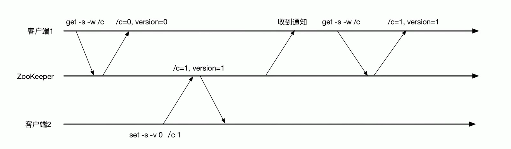
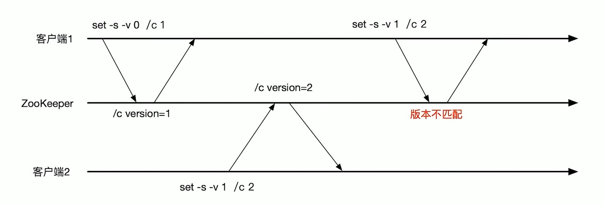
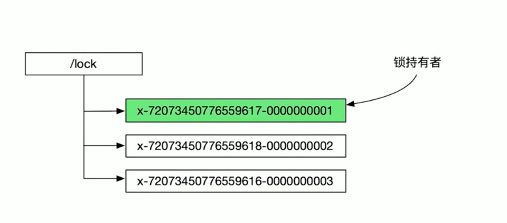

# Api


## 连接Zookeeper服务器

Zookeeper(connnectString,sessiontimeout,watcher)
- connnectString：域名+端口，比如127.0.0.1:2173
- sessiontimeout:session超时时间
- watcher：监听事件

## 操作api


- create(path,data,flags):创建一个给定路径的znode，并在znode保存data数据，falg为znode类型
- delete(path,version): 根据version匹配对应的znode并删除
- exists(path,watch):判断给定的path上znode是否存在，并设置watch
- getData(path,watch):返回path对应的znode数据，并设置一个watch
- setData(path,data,version):根据给定path得到对应的znode并利用version匹配，设置znode的data数据。
- getchildren(path,watch):返回给定path上的znode孩子名字，并给znode设置watch
- sync(path):把客户端的session连接节点与leader节点同步

这里的所有方法都有同步和异步的版本，同步是得到结果后再返回，而异步是直接返回，结果通过callBack得到

比如：
```java
byte[]getData(String path,boolean watch,Stat stat)
```
为同步方法，会在得到数据后才返回

```java
void getData(String path,boolean watch,DataCallback cb,Object ctx)
```
为异步方法，callback用来接收服务器的响应


## Watch机制
如下图：
- 客户端1发送get请求是附带了-w 表示监听znode(/c)的变化
- 客户端2设置znode(/c)的version内容之后，客户端1就会收到通知
- 客户端1接收到通知后可以根据程序逻辑进行下一步操作



## Version机制

1. 客户端1第一次把znode(/c)的version值从0设置为1 条件是version必须为0
2. 然后客户端2把znode(/c)的version值从1设置为2 条件是version必须为1
3. 客户端1znode(/c)的version值从1设置为2 条件是version必须为1，但是这时候version已经被客户端2修改为2了，所以执行失败




# 如何实现一个分布式锁

### 设计

使用临时顺序性节点znode来表示锁，最小后缀数字znode拿到锁，比如下图中后缀数字为1的znode拿到锁



**避免羊群效应：**

什么是羊群效应：
把锁的请求者按照后缀进行排序，后缀最小的请求者获取锁，如果其他的锁持有者都watch这个获得锁的请求者，一旦锁释放，那么所有的请求者都会收到信息，都来竞争这个锁，这就是羊群效应

我们应该避免让所有的锁来竞争，应该让请求者watch它前面的锁请求者，这样每次锁释放的时候都只有一个请求者被通知，同时也遵循公平性原则，先来的请求先得到锁。

