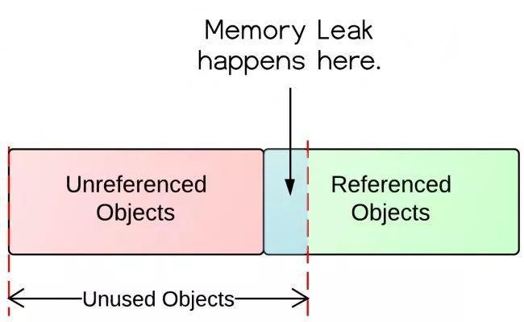

# Voliate关键字

一个变量使用voliate修饰之后它就是线程共享的，

**它的实现原理：**

在多线程中，一个线程在获取某个变量的值的时候，并不是直接到内存中去获取，而是先在CPU一级缓存中查找该变量是否存在，如果存在则直接获得，否则再去内存中去获取到存到CPU一级缓存中。所以，在多线程的情况下就容易出现CPU一级缓存不一致的情况。

voliate是一种通知机制，当内存中的值被修改之后，它会通知所有的CPU一级缓存对应变量的值已经被修改了，但是并不更新所有CPU缓存的值，而是等待线程往CPU缓存中获取值的时候再重新从内存中读取，从而实现缓存的一致性。


两个作用：
1. 保证此变量对所有的线程的可见性。

2. 禁止指令重排序优化。有volatile修饰的变量，赋值后多执行了一个“load addl $0x0, (%esp)”操作，这个操作相当于一个内存屏障（指令重排序时不能把后面的指令重排序到内存屏障之前的位置），只有一个CPU访问内存时，并不需要内存屏障；（什么是指令重排序：是指CPU采用了允许将多条指令不按程序规定的顺序分开发送给各相应电路单元处理）

# Final关键字

1. 被final修饰的类无法被继承
2. 被final修饰的函数无法被重写
3. 被final修饰的变量内存地址不能被改变，但是值是可以改变的，比如被final修饰的ArrayList可以添加元素


# Synchronized

https://blog.csdn.net/javazejian/article/details/72828483?locationNum=5&fps=1

https://cloud.tencent.com/developer/article/1465413

# CAS

https://www.jianshu.com/p/ab2c8fce878b

CAS是JUC包下面很多并发安全类的辅助功能，比如AtomicInterger中的conpareAndSet方法，它底层调用类unsafe包下的compareAndSwapInt方法，它利用一个内存地址去判断某个值是否为expect的值，如果符合就把它修改为update，否则就不作任何改变并返回false。

```java
public final boolean compareAndSet(int expect, int update) {
        return unsafe.compareAndSwapInt(this, valueOffset, expect, update);
    }
```

在某些场景下可以利用自旋保证更新一定成功

unsafe包下的getAndAddInt方法
```java
 public final int getAndAddInt(Object var1, long var2, int var4) {
        int var5;
        do {
            var5 = this.getIntVolatile(var1, var2);
        } while(!this.compareAndSwapInt(var1, var2, var5, var5 + var4));

        return var5;
    }

```


CAS是CPU指令级的操作，只有一步原子操作，所以非常快。

但是CAS会导致ABA问题，就是线程1期望值为A，需要修改其他值。而线程2的期望值也是A，线程2先把这个变量修改成B，然后再修改成A。这时候线程1再去调用CAS，虽然在线程1看来这个变量仍然是A并没有变化，但是实质上这个值已经被修改过了。

解决办法：可以使用版本号来解决这个问题，线程2修改变量的值之后需要把版本号+1。每次CAS都需要进行版本号的判断，如果版本号与期望一致就成功修改，并且让版本号+1，否则就修改失败。因为版本号是只增不减的，所以不会出现ABA问题，除非版本号整形溢出


# wait

1. 调用wait()、notify()、notifyAll()之前需要先对对象加锁
2. 调用wait()并上锁之后，线程会从RUNNABLE状态变成BLOCKED状态，并且把当前的线程放入lock对象的等待队列之中


# 内存泄漏

那些仍然被GC Roots引用但是已经不再使用的对象都被称为内存泄漏，这些对象不能被垃圾回收器回收，所以会造成内存溢出导致内存泄漏




## GC Roots

1. JVM线程私有部分中栈中的栈帧引用的局部变量
2. 本地方法栈中的栈帧引用的对象
3. 方法区中类的静态属性引用的对象
4. 方法区中常量引用的对象


# 注解
@Retention

Retention英文意思有保留、保持的意思，它表示注解存在阶段是保留在源码（编译期），字节码（类加载）或者运行期（JVM中运行）。在@Retention注解中使用枚举RetentionPolicy来表示注解保留时期

@Retention(RetentionPolicy.SOURCE)，注解仅存在于源码中，在class字节码文件中不包含

@Retention(RetentionPolicy.CLASS)， 默认的保留策略，注解会在class字节码文件中存在，但运行时无法获得

@Retention(RetentionPolicy.RUNTIME)， 注解会在class字节码文件中存在，在运行时可以通过反射获取到

如果我们是自定义注解，则通过前面分析，我们自定义注解如果只存着源码中或者字节码文件中就无法发挥作用，而在运行期间能获取到注解才能实现我们目的，所以自定义注解中肯定是使用 @Retention(RetentionPolicy.RUNTIME)


@Target
Target的英文意思是目标，这也很容易理解，使用@Target元注解表示我们的注解作用的范围就比较具体了，可以是类，方法，方法参数变量等，同样也是通过枚举类ElementType表达作用类型
@Target(ElementType.TYPE) 作用接口、类、枚举、注解
@Target(ElementType.FIELD) 作用属性字段、枚举的常量
@Target(ElementType.METHOD) 作用方法
@Target(ElementType.PARAMETER) 作用方法参数
@Target(ElementType.CONSTRUCTOR) 作用构造函数
@Target(ElementType.LOCAL_VARIABLE)作用局部变量
@Target(ElementType.ANNOTATION_TYPE)作用于注解（@Retention注解中就使用该属性）
@Target(ElementType.PACKAGE) 作用于包
@Target(ElementType.TYPE_PARAMETER) 作用于类型泛型，即泛型方法、泛型类、泛型接口 （jdk1.8加入）
@Target(ElementType.TYPE_USE) 类型使用.可以用于标注任意类型除了 class （jdk1.8加入）

https://www.jianshu.com/p/9471d6bcf4cf


# 动态代理

## jdk实现方式

被代理类

```java
public interface ToBPayment {
    void pay();

}

```


```java
public class ToBPaymentImpl implements ToBPayment {
    @Override
    public void pay() {
        System.out.println("ToB支付中————");
    }
}

```

代理类

```java

public class AliInvocationHandler implements InvocationHandler {

    private Object targetObject;
    public AliInvocationHandler(Object object){
        this.targetObject = object;
    }

    @Override
    public Object invoke(Object proxy, Method method, Object[] args) throws Throwable {
        Before();
        Object result = method.invoke(targetObject,args);
        After();
        return result;


    }

    private void Before(){
        System.out.println("支付前:验证支付安全环境");
    }
    private void After(){
        System.out.println("支付成功:扣除库存");
    }
}

```

创建类
```java

public class JdkDynamicProxyUtil {

    public static  <T> T newProxyInstance(T target, InvocationHandler invocationHandler){
        ClassLoader classLoader = target.getClass().getClassLoader();
        Class<?> []interfaces = target.getClass().getInterfaces();
        return (T)Proxy.newProxyInstance(classLoader,interfaces,invocationHandler);

    }
}

```

运行案例

```java

  ToBPayment toBPayment = new ToBPaymentImpl();
        AliInvocationHandler aliInvocationHandler = new AliInvocationHandler(toBPayment);
        ToBPayment toBPaymentProxy =  JdkDynamicProxyUtil.newProxyInstance(toBPayment,aliInvocationHandler);
        toBPaymentProxy.pay();
```

## cglib实现


代理类

```java


public class AliMethodInterceptor implements MethodInterceptor {


    @Override
    public Object intercept(Object o, Method method, Object[] objects, MethodProxy methodProxy) throws Throwable {
        Before();
        Object re = methodProxy.invokeSuper(o,objects);
        After();

        return re;
    }

    private void Before(){
        System.out.println("支付前:验证支付安全环境");
    }
    private void After(){
        System.out.println("支付成功:扣除库存");
    }
}

```


创建类
```java

public class CglibUtil {
    public static <T> T createProxy(T targetObject, MethodInterceptor methodInterceptor){
        return (T) Enhancer.create(targetObject.getClass(),methodInterceptor);
    }


}


```

运行案例

```java

CommonPayment commonPayment = new CommonPayment();
        AliMethodInterceptor aliMethodInterceptor = new AliMethodInterceptor();
        CommonPayment commonPaymentProxy= CglibUtil.createProxy(commonPayment,aliMethodInterceptor);
        commonPaymentProxy.pay();
```


## cglib和jdk代理的区别

jdk代理的类需要实现接口，基于反射机制实现。
而cglib代理的类不需要实现接口，基于ASM机制来实现的

jdk代理的优势：
1. jdk内部原生，比较可靠
2. 支持jdk的升级

cglib的优势：
1. 被代理的类不需要实现接口

Spring的AOP是jdk代理和cglib并存，当被代理类没有实现接口的时候就选择使用cglib，实现了接口就实现jdk代理

