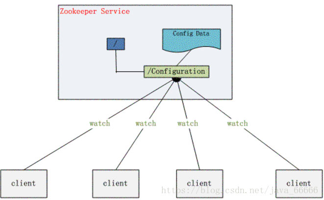

# Zookeeper有哪些应用？
1. master节点选举，当主节点挂掉之后，让从节点成为接手成为主节点，并保证这个节点是唯一的，保证集群的高可用
2. 统一配置文件管理

假设我们的程序是分布式部署在多台机器上，如果我们要改变程序的配置文件，需要逐台机器去修改，非常麻烦，现在把这些配置全部放到zookeeper上去，保存在 zookeeper 的某个目录节点中，然后所有相关应用程序对这个目录节点进行监听，一旦配置信息发生变化，每个应用程序就会收到 zookeeper 的通知，然后从 zookeeper 获取新的配置信息应用到系统中。

3. 发布与订阅，类似消息队列MQ,dubbo发布者把数据存在znode上，订阅者会读取到这个数据。

4. 提供分布式锁，分布式环境中不同的进程之间争夺资源，类似余多线程中的锁。

5. 集群管理，集群中保证数据的强一致性。

# Zookeeper如何保证数据强一致性

ZAB协议：
https://www.cnblogs.com/love-htt/p/12669580.html

https://www.jianshu.com/p/2bceacd60b8a

https://mp.weixin.qq.com/s?__biz=MzI4NTA1MDEwNg==&mid=2650764806&idx=1&sn=48d6d8a99bbaee3dcac2e12e3bf04ea7&chksm=f3f9c393c48e4a85dd5e4b2f741934ec3919c7fc4d4b7cfc26422f6f0977fbcafb8b30dcec5a&mpshare=1&scene=24&srcid=0105FEZLQd1wIshoJGfSDSX4&key=e58c60872eb97b11b762dca1ca1a39524e285b7e7e284fa90d835cc587cd24be77863773de3eb26f4f361ce6d2cc7102954c85abb312df1ae20260f353cfbffe6df7e7547f7d769809a9156ad4122cb5&ascene=0&uin=Nzc5NTUyMTQw&devicetype=iMac14%252C1+OSX+OSX+10.12.5+build(16F73)&version=12020610&nettype=WIFI&lang=zh_CN&fontScale=100&pass_ticket=S3JxgA9EegL3%252FLyZHJR7A4UUD6efECHmVViRoiiCAEvrQ%252FsOgKfJU7SiM8TTfYn3
