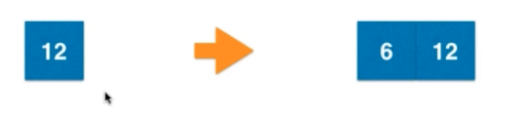
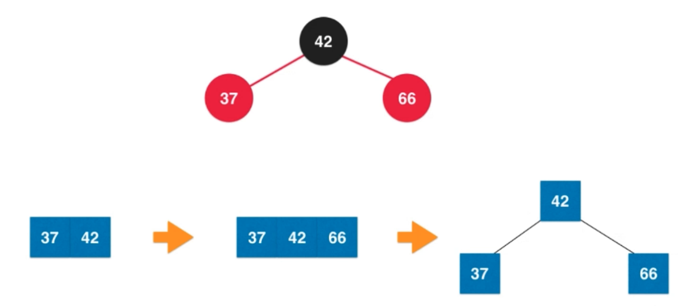
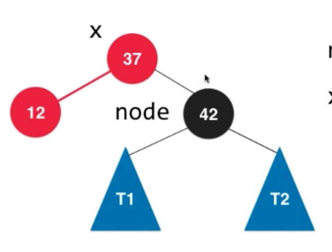

# 红黑树

## 红黑树基本概念
 - 所有节点都是红色或者黑色
 - 根节点一定为黑色
 - 每一个叶子节点都是黑色的
 - 如果一个节点是红色的，那么它的孩子节点都是黑色的
 - 从任意一个节点到叶子节点经过的黑色节点是一样的

## 2-3树
在介绍红黑树之前了解2-3树有助于加深对红黑树的理解。2-3树是一颗绝对平衡的树，所有叶子节点都在同一高度上。

### 2-3树的节点类型
1. 节点可以存放一个或者两个元素，存放一个元素的节点称为2-节点，存放两个元素的节点称为3-节点
2. 当节点存放两个元素时左边的值比b要小，中间的值比b大比c小，右边的值比c大

### 2-3树添加节点规则

2-3树添加节点的规则是永远不会添加到空的位置上

比如以下例子，37这个节点要插入到42中，因为42节点的左孩子为空，所以新节点并不会成为根节点的左孩子，而是与它融合成为一个3-节点

另外一个例子：

一个节点要插入到以下2-3树中

首先18会与37比较，因为18<37,而且37有左孩子，所以18会进入37的左孩子12中，与12作判断，因为18>12所以18会与12融合成一个3-节点

通过以上例子我们可以知道，一个节点最终插入的位置是没有孩子节点的，比如12它就没有孩子节点。

掌握来这一规则之后来看以下的情况：

**插入到2-节点：**
当一个节点要插入到2-节点中时，它会直接与2-节点融合变成一个3-节点

**插入到3-节点：**
当一个节点要插入到3-节点中时，它会先与3-节点融合变成一个4-节点，然后再分裂成一个左右孩子的结构

但是在大多数情况下，分裂之后会导致树的不平衡，所以分裂之后的节点还需要与父亲节点进行融合

**插入到3-节点，父亲为2-节点：**

因为分裂之后会不平衡，所以分裂之后的值为4的节点还会与值为6的节点也就是它的父亲节点进行融合，因为它的父亲节点是一个2-节点，所以它会直接与2-节点融合变成一个3-节点

**插入到3-节点，父亲为3-节点：**

分裂之后，值为4的节点会与它的父亲节点融合，因为父亲节点是一个3-节点，所以它会暂时与父亲节点融合变成一个4-节点，然后再次分裂。如果这时候分裂之后的头部节点仍然有父亲节点，那么仍然需要进行合并。

正是以上的插入方法保证了2-3树的绝对平衡性，下面我们将根据2-3树来推导出红黑树的概念

## 红黑树

### 2-3树变成红黑树

我们尝试用非融合的点来表示融合的3-节点，所以就有了红黑树的节点表现形式

可以看到，我们使用一个红色的节点以及一个黑色的节点就可以代替我们2-3树中的3-节点，需要注意的是，**所有的红色节点都是左倾斜**的，也就是红色节点不可能是黑色节点的右孩子

所以一颗2-3树就可以用这样的方法变成一颗红黑树

我们以此法变形之后的红黑树符合以下的四个准则

- 所有节点都是红色或者黑色
 - 根节点一定为黑色
  
根节点一定是一个2-节点或者3-节点，我们通过上面的节点变换图可以得知黑色节点一定在红色节点之上，所以无论是2-节点还是3-节点它的根节点一定都是黑色

 - 每一个叶子节点都是黑色的

我们从上面的图看可以看到有的叶子节点为红色，有的为黑色，好像并不符合定律，但其实红黑树真正但叶子节点不存储数据的，它是有数据的叶子节点（从有值的角度看）的孩子节点，如下所示

 - 如果一个节点是红色的，那么它的孩子节点都是黑色的
 - 从任意一个节点到叶子节点经过的黑色节点是一样的

这个性质是红黑树的核心性质，我们可以从2-3树的角度来看，因为2-3树是绝对平衡的，所以2-3树从根节点走到任何叶子节点经过的节点个数都是一样的。所以同样的道理应用到红黑树，因为所有的2-3树节点的2-节点和3-节点都包含一个黑色节点，所以从任意一个节点到叶子节点经过的黑色节点是一样的。

从以上性质可以得知所以，红黑树是**保证绝对黑平衡**而并不是绝对平衡的一棵树。在红黑树中，最大的高度为2logn，是AVL树的两倍，所以红黑树查找的时间复杂度为o(logn)

### 红黑树中添加一个新元素

红黑树中添加一个新元素的方法与2-3树一样，都是分成4种情况

因为添加一个新元素之后必定会与原来的元素组成一个3-节点或者4-节点，所以我们有一个定律：新添加的节点一定是红色

#### 添加之后为3-节点

比如：

37是新添加的元素，要添加到42这个节点中，那么它就会与42融合成一个3-节点，成为它的左孩子

但是假如42是新添加的元素，要添加到37这个节点中，那么红色的节点就会变成黑色的节点的右孩子，这并不符合我们之前的定律：红色节点必定为黑色节点的做孩子，所以我们需要作出左旋转

**左旋转：**

以下就是左选择的情况，我们需要把37变成红色，42变成黑色，并让37成为42的左孩子

因为T2<42但是T2>37，所以让T2成为37的右孩子

并让37成为42的左孩子

最后作出颜色的变换

#### 添加之后为4-节点

**颜色翻转：**

比如以下的情况：

66这个节点添加到右边到树中，那么66会成为42的右孩子，也就对应2-3树中的4-节点

在2-3树中对应的就是分裂，其实对照到红黑树中也非常简单，只是做一次颜色的翻转即可

**右旋转：**

比如以下情况：
新添加的节点在红色节点的左边，构成了一个连续的红色节点，所以要作出右旋转

如下图就是变换的过程，因为42>T1>37,所以T1成为42的左孩子，42成为37的右孩子

同时还需要把37的左孩子的颜色变为黑色

### 所有添加之后为4-节点的情况

可以看到这是添加之后为4-节点的情况，最复杂的情况就是先左旋转后右旋转再颜色翻转

## 红黑树与AVL树

AVL树因为最高高度为logn，而红黑树为2logn,所以AVL树更加适合由于查询，如果是插入比较少，而查询比较多的情况下，AVL树性能更好。但是AVL树的缺点是维护成本很大，插入和删除的复杂度较高，而红黑树的插入查询复杂度都是o(logn)，所以在插入删除较多的场景下红黑树更加适用。