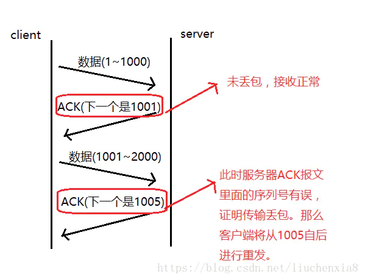
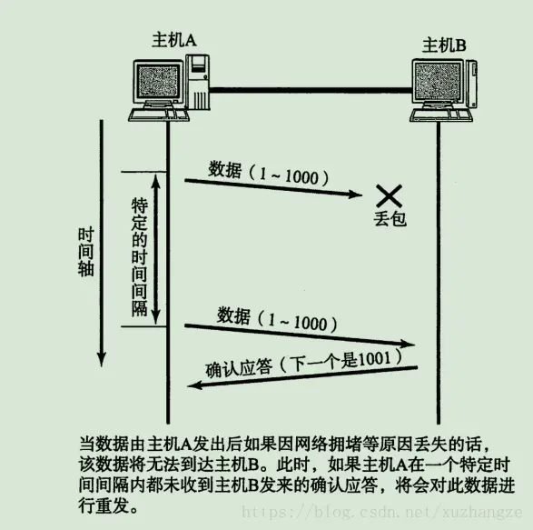
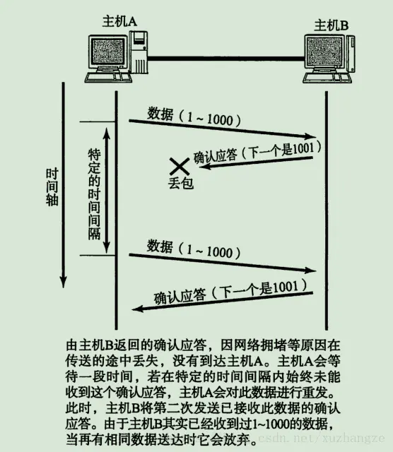
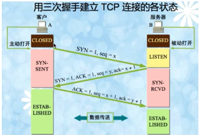
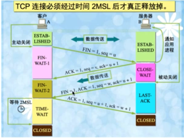
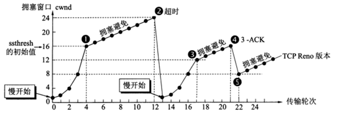

## OSI七层模型，五层模型

osi七层模型:物理层、数据链路层、网络层、传输层、会话层、表示层、应用层

TCP/IP五层模型:物理层、数据链路层、网络层、传输层、应用层

# GET和POST

# TCP的可靠性是如何实现的？

在之前的面试中曾经被面试官问过一个问题：你认为TCP为什么是可靠的？它依赖于哪些东西？之前对TCP的了解并不深入，所以对这个问题并不了解，所以今天就整理一下TCP的可靠性是依赖于哪些条件的。

## 1.校验和
校验和的计算方法如下：

发送端：把TCP分成很多个16字节的数据段，然后将这些数据段进行反码相加，得到相加的结果放入校验和字段中。

接收端：利用相同的办法进行计算，最终判断校验和字段中是不是全部为1，如果全为1则说明校验成功

## 2.确认回答ACK和序列号

**序列号：**
TCP通过序列号来保证传输的可靠性，每次发送数据的时候TCP头部都会有一个seq，代表当前数据包发送的第一个字节数据的序列号

序列号的作用如下：
1. 保证数据是有序到达的
2. 多次发送一次确认
3. 去除重复的数据
4. 通过确认回答保证数据不会丢失

TCP通过确认应答机制实现可靠的数据传输。在TCP的首部中有一个标志位——ACK，此标志位表示确认号是否有效。接收方对于按序到达的数据会进行确认，当标志位ACK=1时确认首部的确认字段有效。进行确认时，确认字段值表示这个值之前的数据都已经按序到达了。而发送方如果收到了已发送的数据的确认报文，则继续传输下一部分数据；而如果等待了一定时间还没有收到确认报文就会启动重传机制。

## 3.超时重传

当客户端发送seq为x的数据包之后如果一段时间没有收到ack=x+1的应答数据包，那么就会启动重传。其中重传时间是动态计算的。

超时重传也分为两种：一种是客户端发送的数据没有到达服务器，另外一种是客户端发送的数据到达来服务器，但是服务器发送的ack数据包没有到达客户端

## 4.连接管理

**三次握手**

1. 第一次客户端发送一个seq（x）序列号，并且SYN标志为1，并消耗掉一个序号
2. 第二次服务器随机发送一个seq（y），并且SYN为1，ACK也为1，ack为x+1，因为第一次的消耗掉了一个序号
3. 第三次客户端发送一个seq（x+1）序列号，并且发送一个ack为y+1，ACK标志为为1

三次发送完毕之后，客户端和服务器建立起全双工的连接

#### 为什么需要三次握手？
从序列号来看，第二次握手是为了确认和初始化客户端的seq序列号，第三次握手为了确认和初始化服务器的seq序列号。

其实第三次握手的主要目的还是为了防止失效的连接请求到达服务器，让服务器错误打开连接。

客户端发送的第一次报文可能会存在无法接收到ack的情况，所以会发生超时重传。这时候可能会出现两个第一次握手的报文传输到服务器，假如服务器在第二次握手后就与客户端建立了连接，那么在这种情况下会建立两个与客户端的连接。如果有第三次握手的存在，服务器会在收到确认ack之后才会建立连接，不用消耗多一个无用的连接。

**四次挥手**

1. 第一次挥手：客户端发送一个FIN=1，并且seq为u的数据包
2. 第二次挥手：服务器发送一个ACK=1，seq为v的数据包，并且ack=u+1，此时数据仍然在传输
3. 第三次挥手：当服务器完成数据传输之后，会开始第三次挥手。服务器发送一个FIN=1，ACK=1的数据包，并且seq为w，ack还是u+1，w，v的差距就是两次服务器挥手间传输的数据量
4. 第四次挥手：客户端发送ACK=1的数据包，seq为u+1，ack为w+1
最后一次挥手后，服务器关闭，客户端进入TIME-WAIT状态，在等待2MSL之后再关闭

#### 为什么需要等待2MSL？

1. 确保最后一个确认报文能够到达。如果 B 没收到 A 发送来的确认报文，那么就会重新发送连接释放请求报文，A 等待一段时间就是为了处理这种情况的发生。

2. 等待一段时间是为了让本连接持续时间内所产生的所有报文都从网络中消失，使得下一个新的连接不会出现旧的连接请求报文。

## 5.流量控制

接收端处理数据的速度是有限的，如果发送方发送数据的速度过快，导致接收端的缓冲区满，而发送方继续发送，就会造成丢包，继而引起丢包重传等一系列连锁反应。

所以流量控制是控制发送方发送数据包的速率。

TCP使用滑动窗口来进行流量控制

考虑一种特殊的情况，接收方向发送方发送了零窗口的报文段后，接收方又有了一些存储空间。与接收方向发送方发送了非零窗口的报文段。然而这个报文段在传送过程中丢失了。发送方的发送窗口一直为零导致死锁。

为了解决这个问题，每个连接设置有持续计时器，只要连接的一方收到零窗口通知，就启动持续计数器。若持续计数器设置的时间到期，就发送一个零窗口探测报文段，而对方就在确认这个探测报文段给出现在的窗口值。如果窗口仍然为零，那么收到这个报文段的一方重置持续计数器，否则，那么死锁的僵局就可以打破。

## 6.拥塞控制

TCP进行拥塞控制的算法有四种，即慢开始，拥塞避免，快重传，快恢复

### 慢开始和拥塞避免

发送的最初执行慢开始，令 cwnd = 1，发送方只能发送 1 个报文段；当收到确认后，将 cwnd 加倍，因此之后发送方能够发送的报文段数量为：2、4、8 ...

当cwnd > ssthresh（慢开始门限）时，改用拥塞避免算法，拥塞避免算法每经过一个往返时间cwnd加1。

当cwnd = ssthresh时，既可以用慢开始也可以使用拥塞避免算法。

当cwnd < ssthresh时，慢开始算法。

当网络出现超时，ssthresh = cwnd / 2，同时设置拥塞窗口cwnd=1.进入慢开始算法。

### 快重传与快恢复
快重传算法要求接收方不要等待自己发送数据才进行捎带确认，而是立即发送确认。即使收到失序的报文段对已发送的报文段的重复确认。发送方一连收到3个重复确认就应当立即进行重传。在这种情况下，只是丢失个别报文段，而不是网络拥塞。因此执行快恢复，发送方调整门限值ssthresh =cwnd/2，同时设置拥塞窗口cwnd=ssthresh ，并开始拥塞避免算法。

慢开始和快恢复的快慢指的是 cwnd 的设定值，而不是 cwnd 的增长速率。慢开始 cwnd 设定为 1，而快恢复 cwnd 设定为 ssthresh。

详细文章：
https://cloud.tencent.com/developer/article/1677672

x-1 x+1 x+2 
x-1 x+1 x
x-1 x+2 x
x-1 